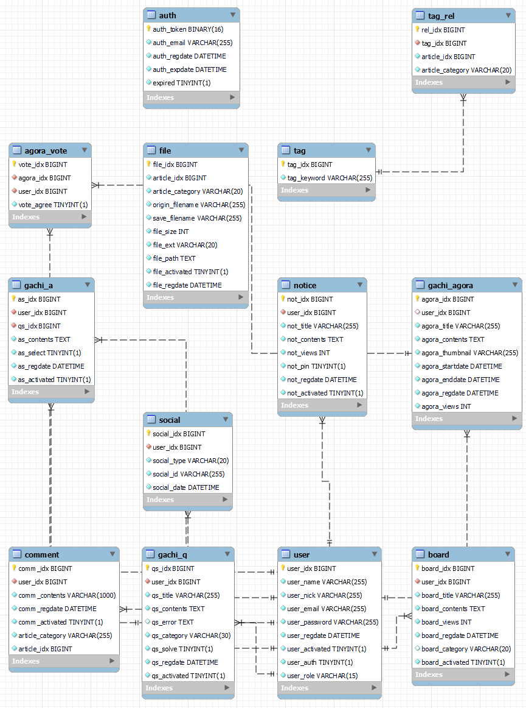

# 가치코딩 - Gachicoding
> 개발 관련 정보 공유, 관련 지식을 묻고 답하는 웹 커뮤니티 서비스  

 

* [김인표](https://github.com/kiminpyo)
* [김인환](https://github.com/inhwanK)
* [서영준](https://github.com/95Seo)
* [배지왕](https://github.com/BAE-JI-WANG)
* [김세현](https://github.com/saehyen)

 

## 사용 기술
* Java 11 (jdk-11.0.13)
* gradle 7.4
* react 8.1.2
* aws - ec2, rds, s3
* terraform 1.1.7
* Spring Data JPA
* Spring Security
* swagger2
* lombok

## ERD

## 저장소
* [백엔드 저장소 (현재 저장소)](https://github.com/inhwanK/gachicoding)
* [프론트엔드 저장소](https://github.com/kiminpyo/gachicoding-front-next)
* [DevOps 저장소](https://github.com/BAE-JI-WANG/gachicoding_DevOps)

 

[//]: # (## 프로젝트 이슈 정리)

[//]: # (* [Spring Boot 환경에서 CORS 정책 설정 &#40;Feat. Spring Security&#41;]&#40;https://bool-flower.tistory.com/30&#41;)

[//]: # (* [사용자 인증을 위한 메일 API 개발 과정]&#40;https://bool-flower.tistory.com/19&#41;)

[//]: # (   )

[//]: # (## 주요 이슈 및 트러블슈팅)

[//]: # (* Spring Data JPA - [DynamicInsert,DynamicUpdate 어노테이션의 용도&#40;작성 전&#41;]&#40;&#41;)

[//]: # (* UnexpectedRollbackException - [아이디&#40;이메일&#41; 중복처리에서 @Transactional 에 의한 롤백 예외 발생&#40;작성 전&#41;]&#40;&#41;)

[//]: # (* Spring Security & OAuth2 - [로그인 연동&#40;구글, 카카오, 깃허브&#41;시 기존 아이디와 중복 처리&#40;작성 전&#41;]&#40;&#41;)

[//]: # (* AWS Access Denied - [IAM 계정으로 로그인 시 RDS 접근이 안되는 현상&#40;작성 전&#41;]&#40;&#41;)

[//]: # (* WebMvcConfigurationSupport - [스웨거, pageable 사용을 위해 해당 클래스를 상속받아 오버라이딩&#40;작성 전&#41;]&#40;&#41;)