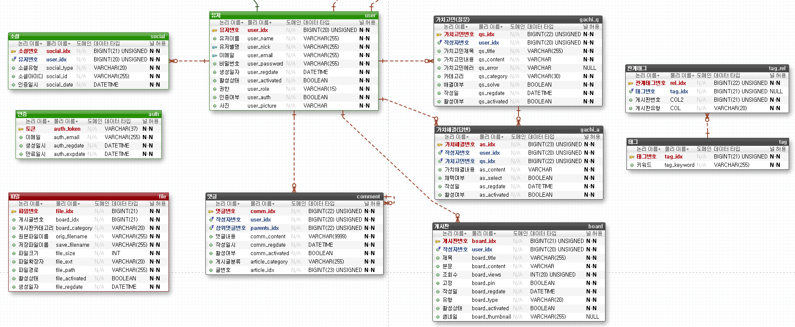

# 가치코딩 - Gachicoding
> 개발 관련 주제들을 가지고 자유롭게 질문하고 토론하는 웹 커뮤니티 서비스  

## 목차
* [저장소](#저장소)
* [참여 인원 및 역할](#참여-인원-및-역할)
* [사용 기술](#사용-기술)
* [서버 구조도](#서버-구조도)
* [ERD](#erd)
* [핵심 기능](#핵심-기능)
* [트러블 슈팅](#트러블-슈팅)

 

## 참여 인원 및 역할

[//]: # (* 2022년 3월 ~ ing)
* [김인표](https://github.com/kiminpyo) - Frontend
* [김인환](https://github.com/inhwanK) - Backend
* [서영준](https://github.com/95Seo) - Backend
* [배지왕](https://github.com/BAE-JI-WANG) - DevOps
* [김세현](https://github.com/saehyen) - DevOps

 

## 저장소
* [백엔드 저장소 (현재 저장소)](https://github.com/inhwanK/gachicoding)
* [프론트엔드 저장소](https://github.com/kiminpyo/gachicoding-front-next)
* [DevOps 저장소](https://github.com/BAE-JI-WANG/gachicoding_DevOps)

 

## 사용 기술
* Java 11 (jdk-11.0.13)
* gradle 7.4
* react 8.1.2
* aws
* terraform 1.1.7
* Spring Data JPA
* Spring Security
* swagger2
* lombok

 

## 서버 구조도

 

## ERD
- 2022.05.05 업데이트

 

## 핵심 기능

 

## 트러블 슈팅
* Spring Data JPA - [DynamicInsert,DynamicUpdate 어노테이션의 용도(작성 전)]()
* CORS - [CORS 정책 위반과 이를 올바르게 해결하는 방법(작성 전)]()
* UnexpectedRollbackException - [아이디(이메일) 중복처리에서 @Transactional 에 의한 롤백 예외 발생(작성 전)]()
* Spring Security & OAuth2 - [로그인 연동(구글, 카카오, 깃허브)시 기존 아이디와 중복 처리(작성 전)]()
* AWS Access Denied - [IAM 계정으로 로그인 시 RDS 접근이 안되는 현상(작성 전)]()
* WebMvcConfigurationSupport - [스웨거, pageable 사용을 위해 해당 클래스를 상속받아 오버라이딩(작성 전)]()