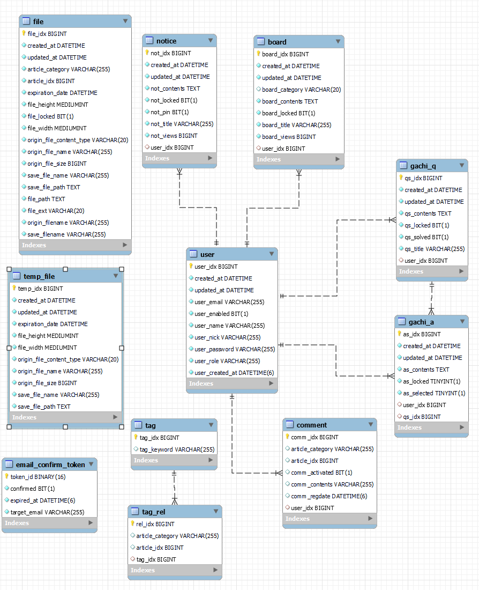

# 가치코딩 - Gachicoding
> 개발 관련 정보 공유, 관련 지식을 묻고 답하는 웹 커뮤니티 서비스  

 

## 인원 
* [김인환](https://github.com/inhwanK) - BE
* [서영준](https://github.com/95Seo) - BE

 

## 사용 기술
* Java 11 (jdk-11.0.13)
* Spring Data JPA
* Spring Security 
* gradle 7.4
* aws - ec2, rds, s3
* swagger2

## 컨벤션
- [Commit Convention](document/convention/commit_convention.md)
- [Issue Convention](document/convention/issue_convention.md)
- [PR Convention](document/convention/pull_request_convention.md)

## ERD

[//]: # (## 저장소)

[//]: # (* [백엔드 저장소 &#40;현재 저장소&#41;]&#40;https://github.com/inhwanK/gachicoding&#41;)

[//]: # (* [프론트엔드 저장소]&#40;https://github.com/kiminpyo/gachicoding-front-next&#41;)

[//]: # (* [DevOps 저장소]&#40;https://github.com/BAE-JI-WANG/gachicoding_DevOps&#41;)