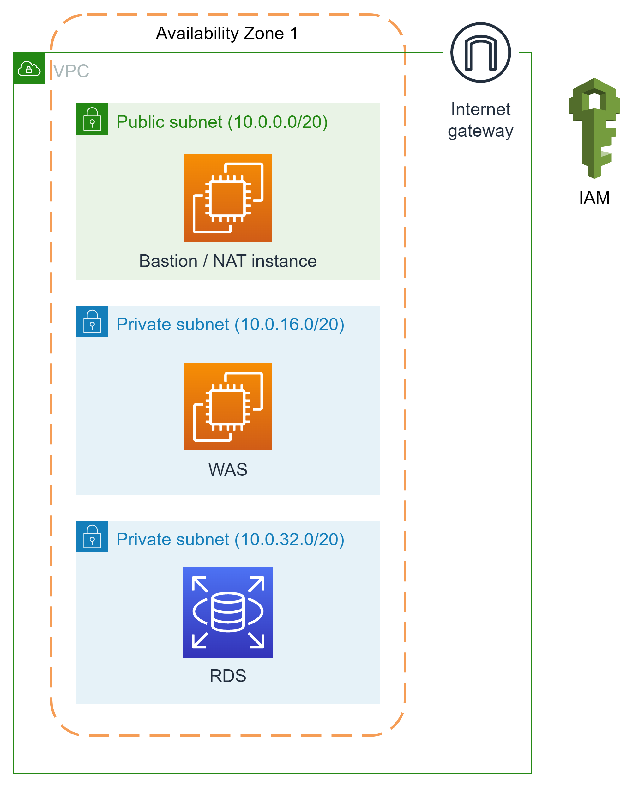

# 가치코딩 - Gachicoding
> 개발 관련 정보 공유, 관련 지식을 묻고 답하는 웹 커뮤니티 서비스  

 

## 인원 
* [김인환](https://github.com/inhwanK) - BE
* [서영준](https://github.com/95Seo) - BE

 

## 사용 기술
* Java 11
* Spring Data JPA
* Spring Security 
* gradle 7.4
* aws - ec2, rds, s3
* swagger2
  
[//]: # ( )

[//]: # ()

## ERD

## 컨벤션
- [Commit Convention](document/convention/commit_convention.md)
- [Issue Convention](document/convention/issue_convention.md)
- [PR Convention](document/convention/pull_request_convention.md)

